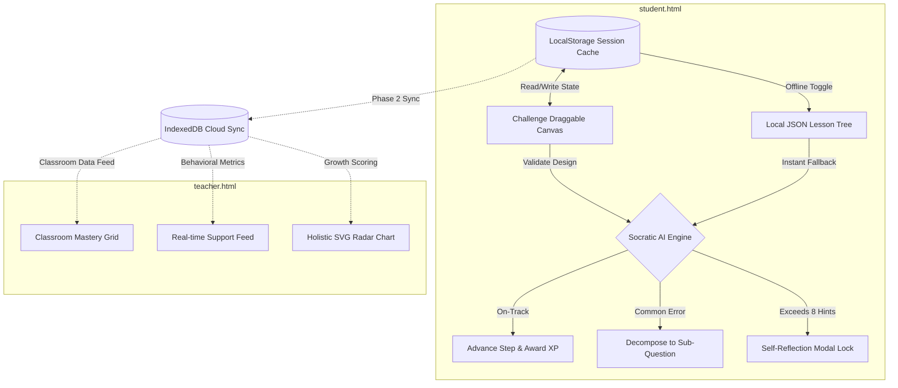

# ⚡ SahAI for Shiksha — Socratic Learning & Holistic Analytics

> **Empowering classrooms with AI-guided Socratic pedagogy, offline-first engineering, and developmental tracking that measures what truly matters: Grit, Curiosity, and Social Empathy.**

[](https://opensource.org/licenses/MIT)
[](#pedagogy)
[](#architecture)
[](#accessibility)

---

## 🌟 The Vision

Traditional assessment models reduce a child's intelligence to a single, stressful score. **SahAI for Shiksha** replaces passive learning and blunt rote-testing with **active Socratic mentoring** and **holistic developmental dashboards**. 

Designed for low-connectivity, hardware-constrained educational environments, SahAI provides:
1. **A Socratic AI Mentor:** Guides students through design challenges. Instead of saying *"Wrong Answer"*, it decomposes complex problems into intuitive Socratic sub-questions.
2. **A Holistic Growth Tracker:** Visualizes multi-dimensional student growth (Grit, Curiosity, Critical Thinking, Collaboration, Academic Mastery) on an interactive radar chart.
3. **An Ultra-Simple Teacher Cockpit:** Surfaces student struggle in real-time, offering instant, empathy-driven remediation activities.
4. **Offline-First Cyber-Pedagogy:** High-fidelity layouts built completely with lightweight static HTML5, HSL tokens, and hardware-accelerated CSS to run smoothly on zero internet connectivity.

---

## 🗺️ Architectural Workflow

The following diagram illustrates how the student Socratic engine, local offline storage, and teacher dashboards interact in real-time.



---

## 🛠️ The Portals (Visual Tour)

### 🧑‍🎓 Student Portal (`student.html`)
The student portal acts as an immersive design lab where learners solve real-world challenges, such as **Rainwater Harvesting Design**.
*   **Interactive Design Canvas:** Draggable system components (Rooftop, Filter, Recharge Well) that snap to drop-zones with active micro-animations.
*   **Socratic Chatbot:** A slide-in chat interface driven by Socratic dialogue trees, supporting keyboard navigation (`Tab` index) and ARIA accessibility live announcements.
*   **Personal Growth Radar:** An inline canvas-drawn radar chart demonstrating the student's current developmental attributes in real-time.

### 🧑‍🏫 Teacher Cockpit (`teacher.html`)
A premium dashboard designed to fit effortlessly into a teacher's classroom routine, ensuring no administrative overload.
*   **Real-time Class Map:** A color-coded grid highlighting which students are *Thriving* (green), *Need Attention* (amber), or are *Stuck* (red).
*   **Concept Gap Analysis:** Aggregated insights indicating which specific syllabus sections are lagging behind class-wide, with a one-click **"⚡ Generate Group Activity"** tool.
*   **Holistic Support Feed:** Real-time social-emotional alerts prioritizing Vaibhav's or Sahil's emotional well-being over raw marks.

---

## 🚀 How to Run the Project

SahAI for Shiksha is engineered with **zero external dependencies** and requires **no build tool or package installation** for Phase 1.

1. Clone this repository:
   ```bash
   git clone https://github.com/[your-username]/interactive-learning-platform.git
   cd interactive-learning-platform
   ```
2. Double-click **`index.html`** in any modern web browser to open the main portal.
3. Select the **Student Portal** or **Teacher Cockpit** to explore the high-fidelity features.

---

## 📅 Roadmap & Execution Plan

We run our development cycle through rigorous **BMAD specifications** to ensure architectural consistency and delivery stability.

```
├── Phase 1: Clickable High-Fidelity Prototype (Current) ──────────────── [Due: 3 June 2026]
│   ├── [✓] Project Shell & Typography Foundations (Story 1.1)
│   ├── [✓] Dynamic Student Socratic Dashboard & Canvas Layout (Story 1.2)
│   ├── [✓] Interactive SVG-drawn Radar Charting System (Story 3.2)
│   └── [✓] Real-time Teacher Analytics Dashboard Mock Data (Story 3.1)
│
└── Phase 2: Live Adaptive MVP Upgrades ───────────────────────────────── [Due: 20 June 2026]
    ├── [ ] Service Worker offline registration & IndexedDB session stores (Story 4.1)
    ├── [ ] Live Gemini API Prompt Orchestration & Empathy Guardrails (Story 4.2)
    └── [ ] Multi-student Collaboration Role Assignment Module (Smart Teams)
```

---

## 🧬 Engineering Principles & Accessibility

*   **Offline-First Resilience (NFR1):** Designed to work flawlessly in rural schools without continuous Wi-Fi. All core assets are bundled or pre-cached.
*   **WCAG AA Compliance (NFR2):** HSL-based dark mode tokens ensure optimal contrast ratios to reduce eye strain.
*   **Semantic HTML & ARIA (NFR3):** Navigable via keyboards (`tabindex`) with correct `aria-live="polite"` descriptors for screen readers during Socratic chat flows.
*   **Hardware Accelerated CSS (NFR5):** Micro-animations (glowing snap guides, level progressions, slide-ins) utilize `transform` and `opacity` to run at a consistent **60 FPS** on ultra-low-spec school laptops.

---

## 📜 License

This project is licensed under the MIT License - see the [LICENSE](LICENSE) file for details.
